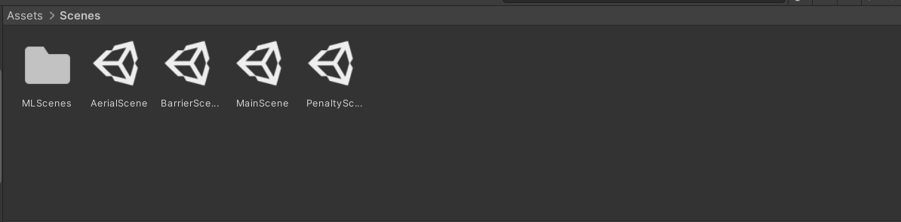
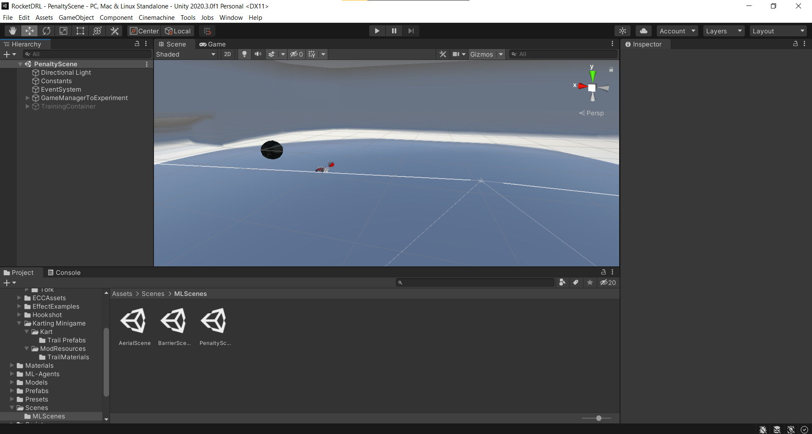
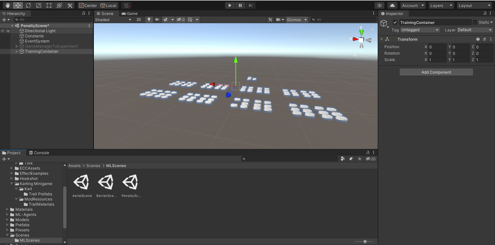

# RocketDRL

RocketDRL is an environment developed for the training of Deep 
Reinforcement Learning Agents, inspired by the game Rocket League. 

The environment was developed with the use of Unity ML-Agents

## Setup
### First Steps
To run the environment locally, you have to download [Unity 2020.3.0 or Above.](https://unity3d.com/pt/unity/qa/lts-releases?version=2020.3)

You can clone this repository or download it in zip format. 

#### Scenes
After import it on Unity, you can go to the directory **Assets/Scenes** and see the following: 

- **Aerial Scene:** Scene of the Aerial Minigame with player controlled behavior, for gameplay tests. 
- **Barrier Scene:** Scene of the Barrier Minigame with player controlled behavior, for gameplay tests. 
- **Penalty Scene:** Scene of the Penalty Minigame with player controlled behavior, for gameplay tests. 
- **MainScene:** Scene containing the core gameplay mechanics, inspired by Rocket League, containing the flow of a regular match, with a player control. 

- **MLScenes:** Folder of Scenes containing the minigames adapted for autonomous controlled behavior, using the ML Agents components. Each scene contains a Game Environment with a pre-trained brain dedicated to the minigame. 

#### Running an Environment

Going to the *MLScenes* folder, you can see the Scenes integrated with the MLAgents framework, related to the implemented minigames. Opening the `PenaltyScene` for example: 

The Object `GameManagerToExperiment` has a environment with a pre-trained agent, showing a example of the integration. You can press Play in the scene and see the autonomous behavior running. 

### Training a Agent
To train a new brain, we use the [ML-Agents Trainer](https://github.com/Unity-Technologies/ml-agents/blob/main/docs/Training-ML-Agents.md). You can see a tutorial of how to install it [here](https://github.com/Unity-Technologies/ml-agents/blob/main/docs/Installation.md#install-the-mlagents-python-package).

Select one of three scenes of `MLScenes` folder. Disable the `GameManagerToExperiment` object and enable the `TrainingContainer`. After this, you can see several environments in the scene view: 

Now, open a prompt, according to your installation mode, and run the following command: 

` mlagents-learn <path/to/your/file.yaml> --run-id=<YourName>`

You should see the instances playing the game.

## Demo

To be added.

  
## License

To be added.

  